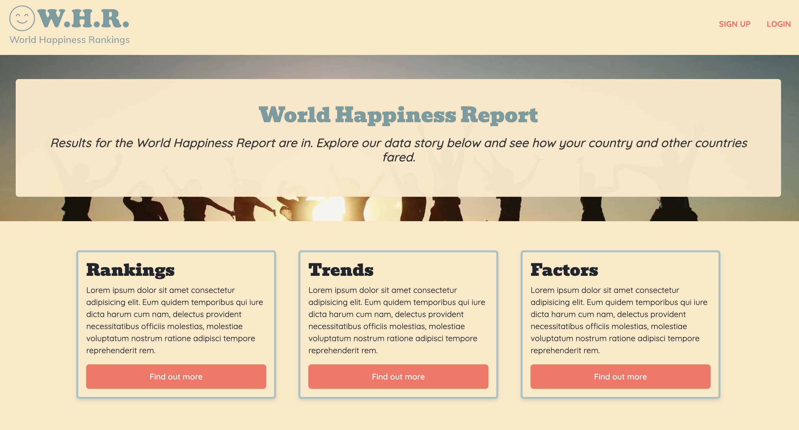
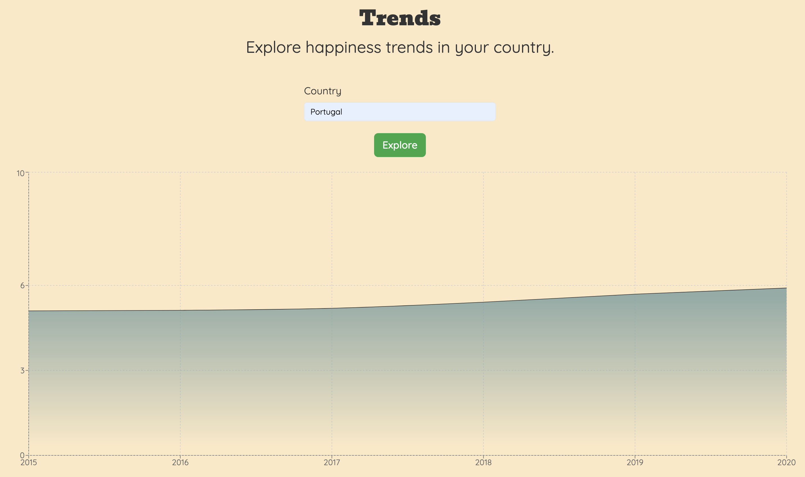
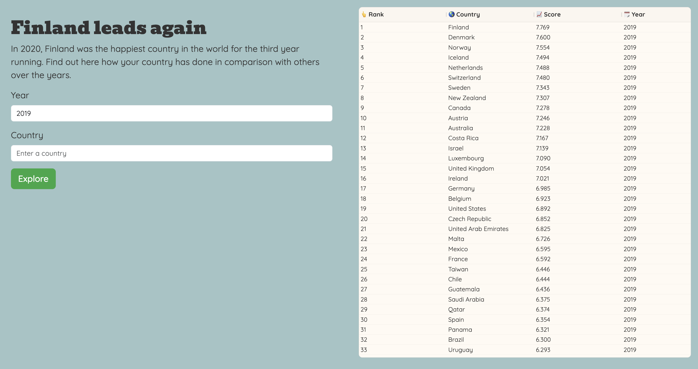

# World Health Rankings

This is a React-based data visualisation project that consumes world happiness data from an API. The project was completed as part of my studies at the Queensland University of Technology.

  
  
  

## Tech

This is (currently) a frontend only app. The project utilises the following technologies:

- **React** for managing user and data state, creating authentication context and custom hooks for data fetching and sanitisation.
- **Bootstrap and React-Bootstrap** for styling and responsive design.
- **Recharts and AG-Grid** for data visualisation/charting.
- **JSON Web Tokens** for handling user sessions and authentication.

## TODO

- consider creating a backend with Node
- consider hosting

**_For more detailed information including how this application was created and a brief user guide, please download the report contained in the report directory of this project._**
